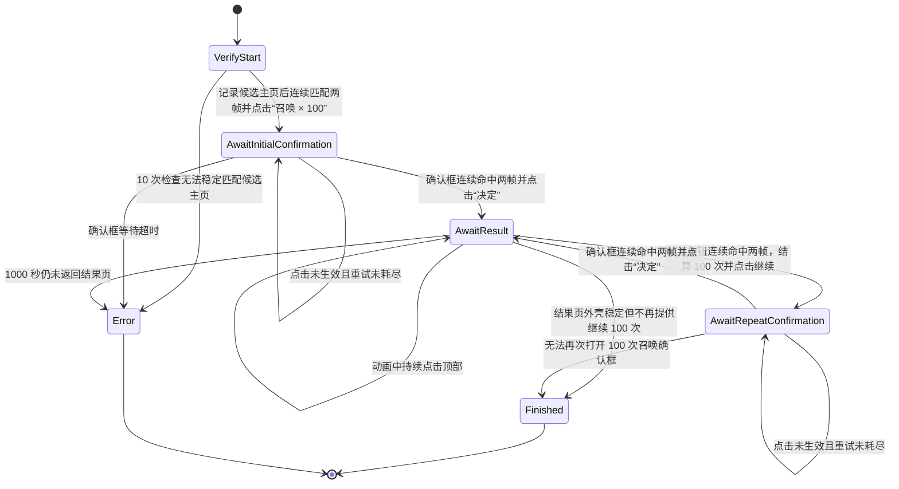

# 友情点抽取自动化

友情点抽取由独立的 `src-tauri/src/friend_point_summon_runner.rs` 驱动，Tauri lifecycle command 位于 `src-tauri/src/commands/automation/friend_point.rs`，当前仅支持国服。它与战斗、从者强化和概念礼装强化 runner 互斥，只共享 ADB、视频流、触控和 CV sidecar 基础设施。

## 页面和安全约束

- 用户先手动进入目标友情池，点击启动即指定本次目标。启动时检测召唤外壳且排除确认框、继续结果页，记录候选画面；后续连续两帧匹配候选特征后点击“召唤 × 100”。不再依赖静态友情点主页文字模板，也不把候选画面视为友情池认证。错误卡池仍须由独立确认框校验拦截。
- 临时主页参考由应用级友情点任务 handle 持有，runner 共享，使用系统临时文件，不进入 sidecar 缓存。点击“决定”、正常结束、手动停止或报错均不删除；下一次被接受的手动启动先清除旧参考，再重新采样。被互斥检查或服务器检查拒绝的启动不清除旧参考。应用退出时释放临时文件，不跨应用重启保留。设备绑定本次 runner；启动识别期间视频分辨率变化立即报错，要求重新启动。启动识别的每轮探针使用同一截图。
- 主页身份要求标题区域 `(0.39, 0.505, 0.23, 0.09)` 和中央卡池画面 `(0.40, 0.20, 0.25, 0.23)` 同时达到 0.90，相邻搜索范围各扩展 0.005；避开顶部余额、底部日期。候选记录后固定，不用未知页面覆盖。启动最多检查 10 次，动态画面不能稳定匹配时停止。
- “召唤 × 100”的点击区域为 `x=0.678, y=0.711, w=0.013, h=0.019`，实际点击中心为 `(0.6845, 0.7205)`。
- 只有连续两帧命中 `dialog_grand_summon_friends_point_confirmation` 后，才允许点击“决定”。
- 确认框使用“自动变还设定”按钮作为识别特征，不匹配友情点金额或卡池说明。常规池与限时池的上方文案不同，不应影响确认框识别；该探针不用于点击“自动变还设定”。
- “决定”的点击区域为 `x=0.654, y=0.775, w=0.014, h=0.022`，实际点击中心为 `(0.661, 0.786)`。
- 动画阶段每 400ms 检查一次页面，每 1000ms 点击一次顶部 `(0.685, 0.095)`，最长等待 1000 秒，以覆盖首次获得从者时的长动画。
- 只有结果页连续两帧命中 `button_grand_summon_friends_point_continue_100`，或结果页外壳稳定但该按钮持续缺失时，才把待结算批次记为完成 100 次。
- 继续按钮使用模板匹配中心点击，不使用固定坐标。
- 所有点击在物理坐标层加入 ±6px 抖动。
- 任一点击最多重试 3 次；无法解释的页面或超时会停止，不盲点恢复。

## CV 配置

模板统一按参考宽度 1920 配置 `templateReferenceWidth: 1920`。确认框模板取自“自动变还设定”按钮，搜索区域覆盖弹窗下半部的中央按钮；其余元素沿用原来的提取区域：

| 元素 | paddedRoi |
| --- | --- |
| `screen_grand_summon` | `0.802, 0, 0.198, 0.107` |
| `text_grand_summon_friends_point` | `0.403, 0.482, 0.196, 0.135` |
| `dialog_grand_summon_friends_point_confirmation` | `0.35, 0.55, 0.3, 0.18` |
| `button_grand_summon_friends_point_continue_100` | `0.5, 0.889, 0.194, 0.091` |

`screen_grand_summon` 用于限制候选捕获页面和辅助结果等待；不能认证友情池。静态主页文字元素仍用于后续原有流程的识别，只有启动及首次确认框等待改用临时主页特征。

临时主页识别仅用于启动与首次点击重试。首次确认后，动画跳过、结果判断、批次计数、继续召唤及停止条件均沿用原有流程，不新增“返回主页即停止”的分支。确认框消失后主页可能短暂露出，这是进入召唤动画的正常过渡，不能作为结束条件。模板保留不代表在后续召唤流程中启用主页路由。现有独立 runner 尚无自动变还/强化往返编排。

离线回归包含常规池、限时池的 PR 原始裁剪图，以及去除金额/卡池文案、去除识别按钮的变体。裁剪图仅验证特征及缩放，不作为完整设备画面的坐标依据；生产 ROI 另用合成画面覆盖 1920×1080 和 1280×720。修改后的实际 ROI 仍需完整画面验证。

## 状态机



确认框的识别优先级最高，其次是精确的“继续进行100次召唤”按钮、主页特征和灵基召唤页面外壳（启动阶段使用临时特征，后续使用原有静态文字探针）。这样即使弹窗背后的主页或结果页模板仍有残留分数，也不会绕过二次友情点校验。

## 生命周期和事件

外部生命周期为：

```text
Idle -> Starting -> Running -> Finished
                           \-> Error
Starting/Running -> Idle（用户停止）
```

事件名为 `friend-point-summon-automation-status`，包含：

- `status`
- `currentScreen`
- `message`
- `completedBatches`
- `summonedCount`

批次和次数由 Rust runner 维护，前端只负责展示。

临时主页离线回归覆盖真实限时池画面在 1920×1080、1280×720 下的 JPEG 压缩、余额/日期变动，以及标题、卡池画面被替换和弹窗遮挡的负例。尚未验证所有卡池布局；特征无法稳定匹配时需要停止并调整采样区域。

## 满仓维护识别（开发中）

接续开发前先读[跨电脑交接记录](../development/friend-point-inventory-maintenance-handoff.md)。其中列出代码入口、环境准备、未接入草稿和验证边界。

新增 `dialog_friend_point_ce_inventory_full` 探针，参考宽度 1920，阈值 0.90，搜索区域 `(0.255, 0.19, 0.48, 0.09)`。模板取自结果页概念礼装满仓弹窗的首行固定提示，避开库存数字。离线测试覆盖 1920×1080、1280×720、数量变化与缺失标题/主页负例。目前尚未接入变还与强化编排；接入时该弹窗必须优先于背景的继续按钮识别。

### 已确认的清仓规则

- 自动变还仅允许三星及以下、明确识别为未锁定的从者。
- 从首页进入路径为“菜单 → 商店 → 灵基变还 → 从者”。筛选设定同时设置星级（一至三星）和种类（仅“从者”开启，“经验值”“芙芙”关闭）。种类位于滚动内容中，先定位“种类”标题，再读取下方按钮状态，避免依赖固定滚动距离。当前截图中白色表示开启，蓝色表示关闭。
- 种火、芙芙、概念礼装和指令纹章不属于本次变还对象，不能因它们出现在“从者”页签中而选中。
- 星级、卡片类型或锁定状态识别不明确时不选中；不得自动解锁。
- 礼装满仓由新的循环策略处理：底卡使用可配置的一星或二星 1 级卡，自动选择一、二星未强化及已强化素材；有合适的已强化素材时替换最后一张，否则按自动选择结果强化。成品达到 50 级及以上后锁定保存，未达到的留作后续素材。
- 变还与恢复召唤草稿位于 `src-tauri/src/friend_point_summon_runner/maintenance.rs`，尚未由父模块声明，不参与编译或测试，不能当成已完成的执行器。
